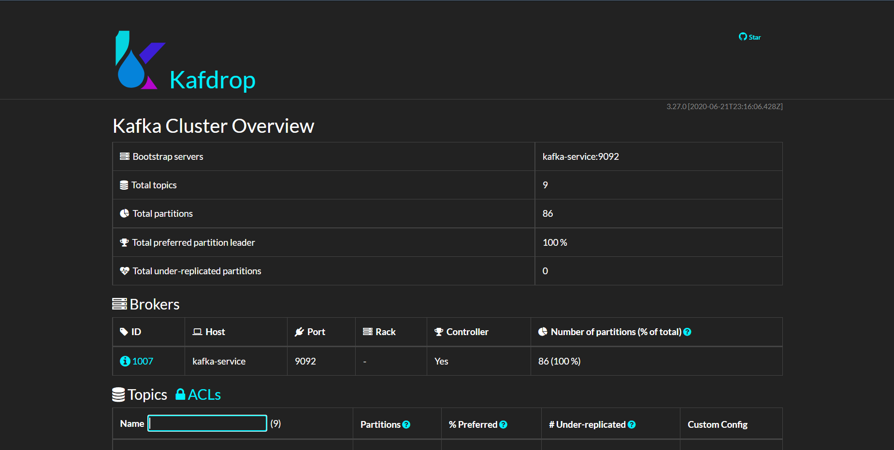

# Implementacion de kafka en kubernetes

## Tabla de Contenidos
- [Descripción](#Descripción)
- [Zookeeper](#Zookeeper)
- [Kafka](#Kafka)
- [Kafdrop](#Kafdrop)
- [Kafka-rest](#Kafka-rest)
- [Kafka-connect](#Kafka-connect)

## Descripción 🚀
Manifiestos necesarios para la implementacion de kafka en kubernetes se debe seguir el siguiente orden para garantizar su funcionamiento.

## Zookeeper
Primero ejecutar el manifiesto zookeeper.yaml, este contiene servicio y deployment.
Se usa el siguiente comando: kubectl apply -f zookeeper.yaml
## Kafka
Luego ejecutar el manifiesto kafka.yaml, este contiene servicio y deployment.
Se usa el siguiente comando: kubectl apply -f kafka.yaml
## Kafdrop
Kafdrop permite visualizar y administrar los topicos de kafka, para ello se debe ejecutar el manifiesto kafdrop.yaml.
Se usa el siguiente comando: kubectl apply -f kafdrop.yaml

## Schema-registry
Para implementar shema-registry se tienen dos manifiestos schema-registry.yaml y schema-service.yaml
Primero ejecutar: kubectl apply -f schema-registry.yaml
Segundo ejecutar: kubectl apply -f schema-service.yaml
## Kafka-rest
Despues ejecutar el manifiesto kafka-rest.yaml
Se usa el siguiente comando: kubectl apply -f kafka-rest.yaml
## Kafka-connect
Por ultimo ejecutar el manifiesto kafka-connect.yaml, este contiene las configuraciones necesarias para su funcionamiento, crea un config map, un servicio y el deployment.
Se usa el siguiente comando: kubectl apply -f kafka-connect.yaml
### Conectores
Para crear los conectores hacia mqtt se debe ingresar al pod de kafka-connect con el siguiente comando: kubectl exec --namespace kafka deployment/kafka-connect-deploy
Luego crear el conector de la siguiente manera:
#### Comando-conectores
curl -X POST   -H "Content-Type: application/json"   --data '{"name": "NombreConector", "config": {"connector.class":"io.confluent.connect.mqtt.MqttSourceConnector", "tasks.max":"1", "mqtt.server.uri":"tcp://ip-mqtt:1883", "mqtt.topics":"NombreTopico", "kafka.topic": "NombreTopico", "mqtt.qos": "1","confluent.topic.bootstrap.servers":"kafka-service:9092","confluent.topic.replication.factor": "1"}}' http://localhost:8083/connectors

